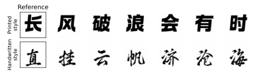
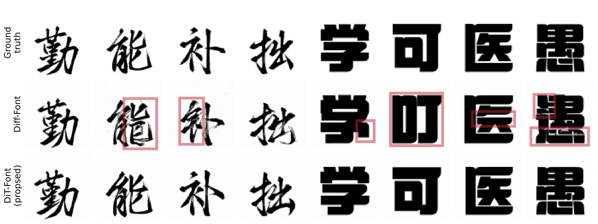

# DiT-Font

DiT-Font is proposed for one-shot font generation tasks, blending the cutting-edge Diffusion Transformer (DiT) architecture with a character encoder carefully crafted to handle glyph-rich languages like Chinese, Japanese, and Korean. This combination facilitates the injection of fine-grained stroke signals during the generation of new images. Extensive experimentation performed on a meticulously curated dataset of Chinese characters, encompassing diverse handwritten and printed font styles across various model and patch sizes. Despite facing constraints in computational resources and reduced training iterations, DiT-Font (S/2) demonstrates competitive performance comparable to its Diff-Font counterpart. Notably, the top-performing DiT-Font (B/2) model surpasses Diff-Font across all four evaluation metrics, highlighting its efficacy and superiority in font generation tasks.

## Samples

One-shot font generation



Comparison with Diff-Font




## Dependencies

```python
pytorch>=1.10.0
tqdm
opencv-python
sklearn
pillow
tensorboardX
blobfile>=1.0.5
mpi4py
attrdict
yaml
```
